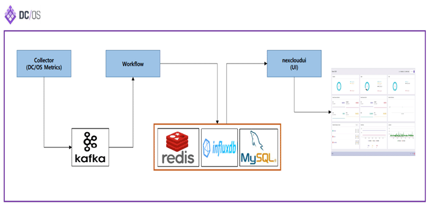

# NexCloud (Beta)

* Please visit for updated virsion  https://github.com/TheNexCloud/NexClipper 
## Summary
NexCloud is the container monitoring and performance management solution specialized in [Docker](https://www.docker.com), [Apache Mesos](http://mesos.apache.org), [Marathon](https://mesosphere.github.io/marathon/), [DC/OS](https://dcos.io), [Mesosphere](https://mesosphere.com), [Kubernetes](https://kubernetes.io/)(Soon).  It will provide container performance management , Microservice automation through API Gateway and Machine learning based predictive, forecasting, abnormal detection with enterprise version.  
  

In this beta version, it support fundamental function to monitor and analyze container cluster(Mesos, DC/OS, Mesosphere), Container, Agent and basic root cause functionality for event management with on-premise version. At next beta and SaaS version, it will provide more rich functionality for root cause (event management, resource tracing, performance monitor and transaction tasing, etc) soon.  

For more detail product, visit http://www.nexcloud.co.kr.

[Prerequisites](#prerequisites) | [Configuration](#configuration-step-before-nexcloud-installation) | [Installation](#installation)
<br>

* Architecture  
    Collector : The part of Nexcloud solution to collect DC/OS Metric, Node etc..  
    Workflow : The part of Nexcloud solution for processing and handling to input all metric data.  
    nexcloudui :The part of Nexcloud solution for visualization.  

    </img>  

* Full Stack Dashboard 
Enterprise Version (below picture is Free Version which has limited function)  
Dashboard shows all summary information about full stack of DC/OS
    </img>  

* Agent Map  
This map shows all information in detail about Node, Agent and host located in cluster.  
    </img>

* Container  
This list shows all information in detail about container which is operating in the cluster.  
    </img>  

<hr>

## Features
* Full Stack Dashboard
* Container Cluster Resource Allocation & Usage Monitoring
* Private Cloud Monitoring: Agent / Container
* Container Performance Monitoring & Tracing
* Event Notification And Event Trace
* Major Framework & Service Monitoring
* Container Status Monitoring
<hr>

## Prerequisites
The installation of Nexcloud can be supported by DC/OS CLI and GUI of Univese. It needs some applications such as Influx, MySQL, Redis, Kafka before the installation of Nexcloud. <br><br>
※	If you have already installed these apps of Influx, MySQL, Redis, Kafka on your DC/OS Clustster, you can use existing apps. However, you have to check the your app's configuration, if specificed configuration is used.  ( It is not necessary, if you use still default configuration of these apps. Please check configuration of Database Name, Password, Account, Port, VIP about these apps )  
<br>

< DC/OS CLI Installation >  / For more information about CLI, Go to Link  (Installing the CLI) <br>
Access to DC/OS CLI installed node <br>

* [InfluxDB](https://universe.dcos.io/#/package/influxdb/version/latest)  
    ```bash
    $ dcos package install influxdb
    ```
* [MySQL](https://universe.dcos.io/#/package/mysql/version/latest) / [MySQL-admin](https://universe.dcos.io/#/package/mysql-admin/version/latest)  
    ```bash
    $ dcos package install mysql
    $ dcos package install mysql-admin
    ```
* [Redis](https://universe.dcos.io/#/package/redis/version/latest)
    ```bash
    $ dcos package install redis
    ```
* [Kafka](https://universe.dcos.io/#/package/kafka/version/latest)
    ```bash
    $ dcos package install kafka
    ```
<hr>

## Installation
Before NexCloud installation, you have to create table and input initial data in the database (Mysql) using below sql scripts. Please login your MySql app. And execute scripts of nex_notification.sql, nex_node.sql, nex_config.sql. 
also please change the configuration part of scretKey, uid in nex_config.sql. this configuration is your cluster information. 

1. Configuration step before Nexcloud installation <br>
o	nex_notification.sql : this sql for create table of notification. <br>
o	nex_node.sql : this sql for create table of DC/OS Node information.<br>
o	nex_config.sql : this sql for input initi data of Nexcloud app configuration<br>
※	these scipts works on the only mysql app. please donwn load this scripts or capy sql query form sql scpirt. and run it in the MySQL app. <br>

2. Select Install Type  

    -> [Group Installation](#group-install)  
       it can be supported to install all apps. ( collector, workflow, nexcloudui )<br>       
    -> [Component Installation](#component-install)<br>
       it can be supported to install each apps memually. ( collector, workflow, nexcloudui )<br>
※	If you are using your existing apps (Influx, MySQL, Redis, Kafka) on your DC/OS Cluster, we recommend to install the component installation way. Because you may be change the environment configuration in your apps.  

* Execute Service  
    http://nexcloud-service-endpoint/v1/dashboard
<hr>

## Configuration Step before Nexcloud installation 
All sql scripts has to be excute in your Mysql app.
1. SQL scripts
    All sql scripts has to be excuted in your Mysql app. 
    * [nex_notification.sql](/SQL/nex_notification.sql)
        * This table is created for saving data of notification  
        <br> 
    * [nex_node.sql](/SQL/nex_node.sql)
        * This table is created for saving the node information of DC/OS.
        <br>
    * [nex_config.sql](/SQL/nex_config.sql)
        * This table is created for nexcloud configuration.  
        * These datas is saved about necessary information of nexcloud configuration.  
            ※ Please change the information of “SecetKey” and “uid”. This information has to be changed in your DC/OS information.
        * This is explaination for each columns of instert quarry. please refer it when you change information
    <hr>

2. Deployment JSON Modify

    * [nexcloud.json](/JSON/nexcloud.json) -> This mark mean explaination for object. please delete it, when you change "env" in the json.<br>
    
        * **"id": "nexcloud/collecter"**
            * Default setting
                ```
                "env": {
                    "MYSQL_DBNAME": "defaultdb",  --> (MySQL DB name)
                    "MYSQL_URL": "mysql.marathon.l4lb.thisdcos.directory:3306",  --> (MySQL URL)
                    "MYSQL_PASSWORD": "password",  --> (MySQL password)
                    "MYSQL_USERNAME": "admin"  --> (MySQL account)
                },
                ```
        ---
        * **"id": "nexcloud/workflow"**
            * Default setting 
                ```
                "env": {
                    "REDIS_HOST": "redis.marathon.l4lb.thisdcos.directory", --> (Redis URL)
                    "MYSQL_DBNAME": "defaultdb",  --> (MySQL DB name)
                    "REDIS_PORT": "6379",  --> (Redis port)
                    "MYSQL_URL": "mysql.marathon.l4lb.thisdcos.directory:3306",  --> (MySQL URL)
                    "MYSQL_PASSWORD": "password",  --> (MySQL password)
                    "MYSQL_USERNAME": "admin" --> (MySQL account)
                },
                ```
        ---
        * **"id": "nexcloud/nexcloudui"**
            * Default setting
                ```
                "env": {
                    "REDIS_HOST": "redis.marathon.l4lb.thisdcos.directory",  --> (Redis URL)
                    "MYSQL_DBNAME": "defaultdb",  --> (MySQL DB name)
                    "REDIS_PORT": "6379",  --> (Redis port)
                    "MYSQL_URL": "mysql.marathon.l4lb.thisdcos.directory:3306", -->(MySQL URL)
                    "MYSQL_PASSWORD": "password",  --> (MySQL password)
                    "MYSQL_USERNAME": "admin"  --> (MySQL account)
                },
                ```

    <hr>

## Group install
* Deploy NexCloud
    ```bash
    $ dcos marathon group add https://raw.githubusercontent.com/nexclouding/NexCloud/master/JSON/nexcloud.json
    ```
    ※	This installation is only for initial user. please install it by this way, if you finished the Configuration Step.
    If you have already installed the apps (Influx, MySQL, Redis, Kafka), please install it by component installation way. 

---

## Component Install
1. [collecter.json](/JSON/components/collecter.json)
    ```bash
    $ dcos marathon app add https://raw.githubusercontent.com/nexclouding/NexCloud/master/JSON/components/collecter.json 
    ```
2. [workflow.json](/JSON/components/workflow.json)
    ```bash
    $ dcos marathon app add https://raw.githubusercontent.com/nexclouding/NexCloud/master/JSON/components/workflow.json  
    ```
3. [nexcloudui.json](/JSON/components/nexcloudui.json)
    ```bash
    $ dcos marathon app add https://raw.githubusercontent.com/nexclouding/NexCloud/master/JSON/components/nexcloudui.json
    ```
