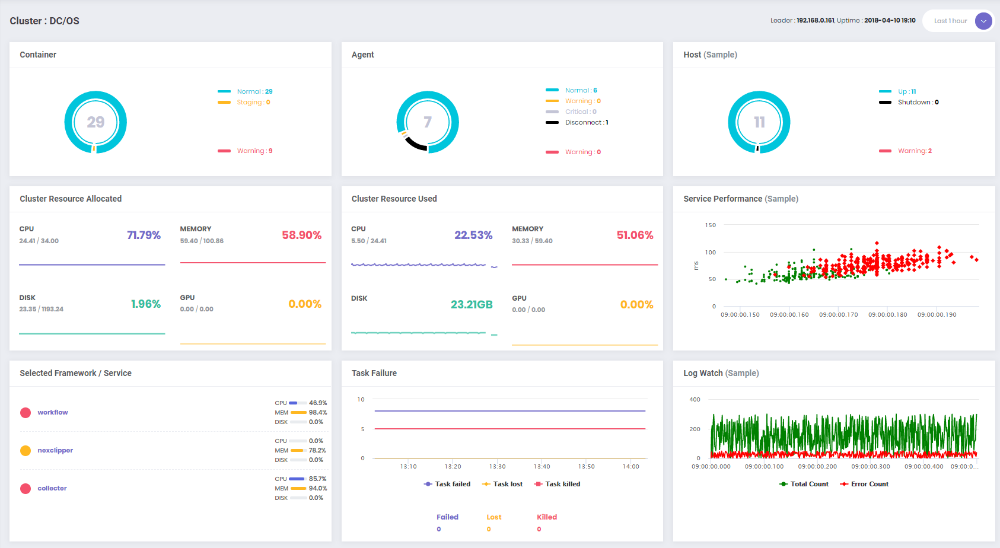
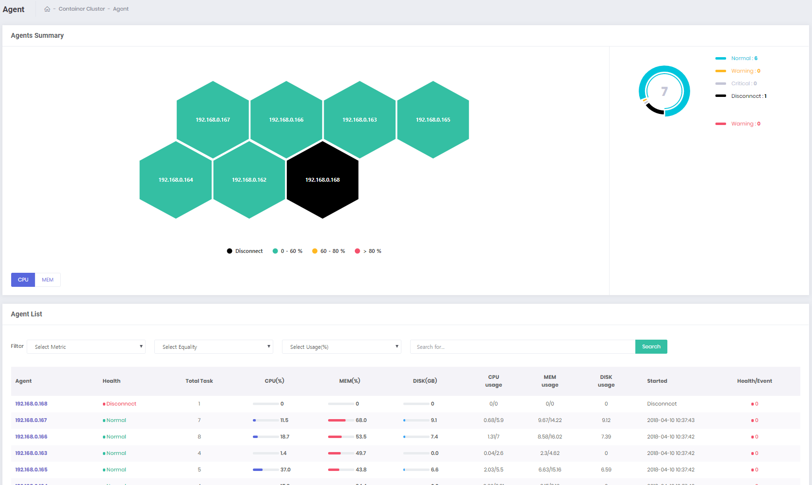
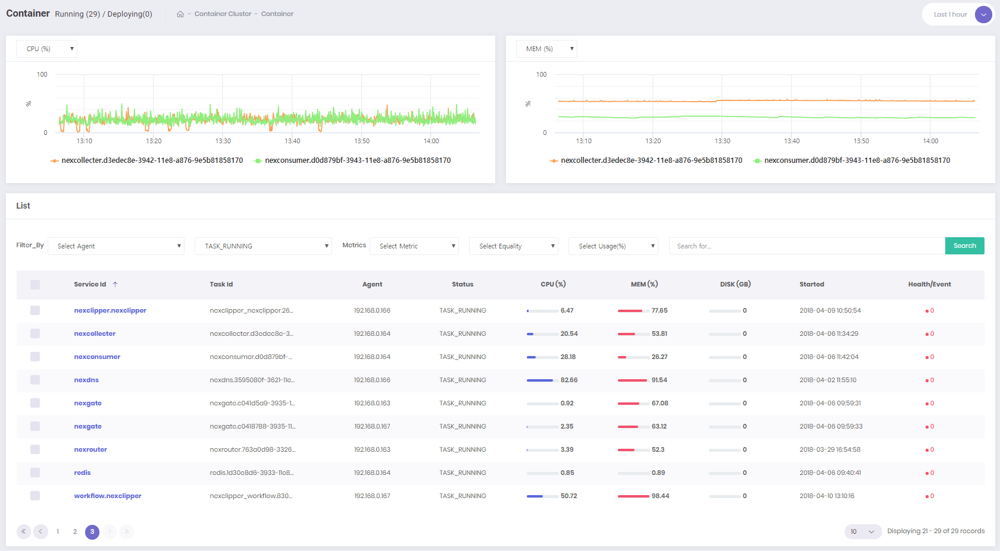

# NexCloud

## Summary
NexCloud는 프라이빗 DC/OS 모니터링 솔루션입니다. Apache MESOS, Marathon 클러스터 요약, 리소스 할당 및 사용현황, 마스터 모니터링, 에이전트 상태를 모니터링하고 전문화된 컨테이너 성능 모니터링 및 관리기능을 제공합니다.  

[Prerequisites](#prerequisites) | [Configuration](#configuration) | [Installation](#installation)

* Architecture  
</img>

* Dashboard  
</img>  
<br>
* Agent Map  
</img>  
<br>
* Container  
</img>

<hr>

## Features
* Private Cloud Monitoring: Agent / Container
* Container Cluster Resource Allocation & Usage Monitoring
* Event Notification And Event Trace
* Major Framework & Service Monitoring
* Container Status Monitoring
<hr>

## Prerequisites
Access to DC/OS CLI installed node  
```bash
$ ssh root@<DC/OS CLI installed node>
```
* [InfluxDB](https://universe.dcos.io/#/package/influxdb/version/latest)  
    ```bash
    $ dcos package install influxdb
    ```
* [MySQL](https://universe.dcos.io/#/package/mysql/version/latest) / [MySQL-admin](https://universe.dcos.io/#/package/mysql-admin/version/latest)  
    ```bash
    $ dcos package install mysql
    $ dcos package install mysql-admin
    ```
* [Redis](https://universe.dcos.io/#/package/redis/version/latest)
    ```bash
    $ dcos package install redis
    ```
* [Kafka](https://universe.dcos.io/#/package/kafka/version/latest)
    ```bash
    $ dcos package install kafka
    ```
<hr>

## Configuration

1. SQL

    MySQL에서 다음 SQL 문을 실행한다.
    * [nex_rule.sql](/SQL/nex_rule.sql)
        * Node / Container의 CPU/Memory 임계치 설정
        * Notification 을 위해 사용
            ```sql
            CREATE TABLE `nex_rule` (
                `idx` INT(11) NOT NULL AUTO_INCREMENT,
                `target_system` VARCHAR(64) NULL DEFAULT NULL COMMENT '대상 시스템 ( H: Host, M:Master, D:Docker, P:Process, A: Agent, T : Task )' COLLATE 'utf8_general_ci',
                `target` VARCHAR(64) NULL DEFAULT NULL COMMENT '대상' COLLATE 'utf8_general_ci',
                `type` VARCHAR(64) NULL DEFAULT NULL COMMENT '종류(Metric, Log )' COLLATE 'utf8_general_ci',
                `scale_type` CHAR(1) NULL DEFAULT 'U' COMMENT 'Scale조건관련( U: Scale UP, D :Scale Down )' COLLATE 'utf8_general_ci',
                `data_source` VARCHAR(128) NULL DEFAULT NULL COMMENT 'influxdb data source ( DCOS, Telegraf, Mesos...)' COLLATE 'utf8_general_ci',
                `table` VARCHAR(128) NULL DEFAULT NULL COLLATE 'utf8_general_ci',
                `metric` VARCHAR(512) NULL DEFAULT NULL COMMENT 'Type이 Metric일경우 Metric 이름. Log일경우 Log file full path ' COLLATE 'utf8_general_ci',
                `math` VARCHAR(512) NULL DEFAULT NULL COMMENT '수식( divid ( / ), sum, avg.. )' COLLATE 'utf8_general_ci',
                `group_by` VARCHAR(512) NULL DEFAULT '' COLLATE 'utf8_general_ci',
                `condition` VARCHAR(512) NULL DEFAULT NULL COMMENT 'Metric조건' COLLATE 'utf8_general_ci',
                `message` VARCHAR(1024) NULL DEFAULT NULL COMMENT '기본 Output Text' COLLATE 'utf8_general_ci',
                `status` ENUM('Y','N') NULL DEFAULT 'N' COMMENT 'Rule사용 여부' COLLATE 'utf8_general_ci',
                `new_engine` ENUM('Y','N') NULL DEFAULT 'N' COMMENT '새로운 엔진 사용여부' COLLATE 'utf8_general_ci',
                `regdt` TIMESTAMP NOT NULL DEFAULT CURRENT_TIMESTAMP,
                PRIMARY KEY (`idx`)
            )
            COLLATE='latin1_swedish_ci'
            ENGINE=InnoDB;
            ```
            ```sql
            INSERT INTO `nex_rule` (`target_system`, `target`, `type`, `scale_type`, `data_source`, `table`, `metric`, `math`, `group_by`, `condition`, `message`, `status`, `new_engine`, `regdt`) VALUES
            ('Agent', 'CPU', 'metric', 'U', 'nexclipper', 'node', 'cpu_used_percent', NULL, 'node_ip', '>95 and >5m', '[%s] 5분동안 CPU 사용율이 95%% 이상 입니다. ', 'Y', 'N', '2018-01-29 01:12:05'),
            ('Agent', 'Memory', 'metric', 'U', 'nexclipper', 'node', 'mem_used_percent', NULL, 'node_ip', '>95 and >10m', '[%s] 10분동안 Memory 사용율이 95%% 이상입니다. ', 'Y', 'N', '2018-01-29 01:12:05'),
            ('Task', 'CPU', 'metric', 'U', 'nexclipper', 'task', 'cpu_used_percent', NULL, 'executor_id', '>95 and >5m', '[%s] 5분동안 CPU 사용율이 95%% 이상 입니다. ', 'Y', 'N', '2018-01-29 01:13:15'),
            ('Task', 'Memory', 'metric', 'U', 'nexclipper', 'task', 'mem_used_percent', NULL, 'executor_id', '>95 and >10m', '[%s] 10분동안 Memory 사용율이 95%% 이상입니다. ', 'Y', 'N', '2018-01-29 01:14:07');
            ```
            <br>
    * [nex_notification.sql](/SQL/nex_notification.sql)
        * notification 데이터 저장 테이블
            ```sql
            CREATE TABLE `nex_notification` (
                `idx` INT(11) NOT NULL AUTO_INCREMENT,
                `severity` ENUM('Critical','Warning') NOT NULL DEFAULT 'Critical' COMMENT 'Notification등급( Critical, Warning)' COLLATE 'utf8_general_ci',
                `target_system` VARCHAR(32) NULL DEFAULT NULL COMMENT 'Notification 대상 ( \'Host\',\'Agent\',\'Task\',\'Framework\',\'Docker\' )' COLLATE 'utf8_general_ci',
                `target_ip` VARCHAR(32) NULL DEFAULT NULL COMMENT '발생대상 IP' COLLATE 'utf8_general_ci',
                `target` VARCHAR(124) NULL DEFAULT NULL COMMENT '발생 대상( CPU, Memory, Disk, Netowrk, System Error..... )' COLLATE 'utf8_general_ci',
                `metric` VARCHAR(512) NULL DEFAULT NULL COMMENT '수행 Metric' COLLATE 'utf8_general_ci',
                `condition` VARCHAR(512) NULL DEFAULT NULL COMMENT 'Condition' COLLATE 'utf8_general_ci',
                `id` VARCHAR(512) NULL DEFAULT NULL COMMENT 'Service/Task/Node/Framework의 Service ID or IP' COLLATE 'utf8_general_ci',
                `status` ENUM('S','F') NULL DEFAULT 'S' COMMENT '상태 (\'S\':발생, \'F\':종료)' COLLATE 'utf8_general_ci',
                `start_time` TIMESTAMP NULL DEFAULT NULL COMMENT '시작시간',
                `finish_time` TIMESTAMP NULL DEFAULT NULL COMMENT '종료시간',
                `contents` TEXT NOT NULL COMMENT 'notification 내용' COLLATE 'utf8_general_ci',
                `memo` TEXT NULL COLLATE 'utf8_general_ci',
                `check_yn` CHAR(1) NOT NULL DEFAULT 'N' COLLATE 'utf8_general_ci',
                `regdt` TIMESTAMP NOT NULL DEFAULT CURRENT_TIMESTAMP,
                PRIMARY KEY (`idx`),
                INDEX `severity` (`severity`),
                INDEX `target_system` (`target_system`),
                INDEX `target_ip` (`target_ip`),
                INDEX `id` (`id`),
                INDEX `status` (`status`),
                INDEX `start_time` (`start_time`),
                INDEX `finish_time` (`finish_time`),
                INDEX `regdt` (`regdt`)
            )
            COLLATE='latin1_swedish_ci'
            ENGINE=InnoDB;
            ```
            <br>
    * [nex_node.sql](/SQL/nex_node.sql)
        * DC/OS 노드 정보
            ```sql
            CREATE TABLE `nex_node` (
                `node_name` VARCHAR(64) NOT NULL COMMENT '노드명',
                `node_ip` VARCHAR(32) NOT NULL COMMENT '노드 IP',
                `node_id` VARCHAR(64) NOT NULL COMMENT '노드 ID',
                `role` VARCHAR(64) NOT NULL COMMENT 'role(agent, master)',
                `parent` VARCHAR(64) NULL DEFAULT NULL COMMENT 'parent host정보',
                `status` VARCHAR(2) NOT NULL COMMENT '노드상태',
                `regdt` TIMESTAMP NOT NULL DEFAULT CURRENT_TIMESTAMP COMMENT '등록일',
                UNIQUE INDEX `node_ip` (`node_ip`)
            )
            COLLATE='utf8_general_ci'
            ENGINE=InnoDB;
            ```
            <br>
    * [nex_config.sql](/SQL/nex_config.sql)
        * 필수 설정 정보
        * Modify
            ```sql
            INSERT INTO `nex_config` (`code`, `value`) VALUES
            ('influxdb'                 , 'INFLUXDB CONNECTION URL'),
            ('kafka_host'               , 'KAFKA BROKER ADDRESS'),
            ('kafka_mesos_group'        , 'KAFKA MESOS CONSUMER GROUP NAME - Unique Name'),
            ('kafka_notification_group' , 'KAFKA ASSURANCE CONSUMER GROUP NAME - Unique Name'),
            ('kafka_port'               , 'KAFKA CONNECTION PORT'),
            ('kafka_zookeeper'          , 'KAFKA ZOOKEEPER CONNECTION URL'),
            ('mesos_topic'              , 'MESOS METRIC KAFKA TOPIC NAME - Unique Name'),
            ('mesos_endpoint'           , 'MESOS ENDPOINT'),
            ('mesos_influxdb'           , 'MESOS METRIC INFLUXDB TABLE NAME - Unique Name'),
            ('mesos_snapshot_topic'     , 'MESOS SNAPSHOT METRIC KAFKA TOPIC NAME - Unique Name'),
            ('notification_topic'       , 'ASSURANCE METRIC KAFKA TOPIC NAME - Unique Name'),
            ('redis_host'               , 'REDIS CONNECTION URL'),
            ('redis_port'               , 'REDIS CONNECTION PORT'),
            ('scretKey'                 , 'DC/OS가 설치된 master 서버의 "/var/lib/dcos/dcos-oauth/auth-token-secret" 데이터'),
            ('uid'                      , 'DC/OS에 등록된 사용자'),
            ('kafka_snapshot_group'     , 'KAFKA SNAPSHOT CONSUMER GROUP NAME - Unique Name');
            ```

        * Default
            ```sql
            INSERT INTO `nex_config` (`code`, `value`) VALUES
            ('influxdb', 'http://influxdb.marathon.l4lb.thisdcos.directory:8086'),
            ('kafka_host', 'broker.kafka.l4lb.thisdcos.directory'),
            ('kafka_mesos_group', 'workflow_consumer'),
            ('kafka_notification_group', 'assurance_consumer'),
            ('kafka_port', '9092'),
            ('kafka_zookeeper', 'master.mesos:2181/dcos-service-kafka'),
            ('mesos_topic', 'data_collector'),
            ('mesos_endpoint', 'http://192.168.0.161'),
            ('mesos_influxdb', 'nexclipper'),
            ('mesos_snapshot_topic', 'data_snapshot'),
            ('notification_topic', 'data_assurance'),
            ('redis_host', 'redis.marathon.l4lb.thisdcos.directory'),
            ('redis_port', '6379'),
            ('scretKey', 'TjRihTXJiMQMvxtOGcLYDqIXgaQJDuLYWYqyCEaxrsOuKULKqKjvgltroQrpGkIP'),
            ('uid', 'admin@nexcloud.co.kr'),
            ('kafka_snapshot_group', 'snapshot_consumer');
            ```
    <hr>

2. JSON
    * [nexclipper.json](/JSON/nexclipper.json)
        * "id": "nexclipper/collecter"
            * Modify
                ```json
                "env": {
                    "MYSQL_DBNAME": "YOUR DBNAME",
                    "MYSQL_URL": "YOUR MYSQL CONNECTION URL",
                    "MYSQL_PASSWORD": "YOUR MYSQL PASSWORD",
                    "MYSQL_USERNAME": "YOUR MYSQL USERNAME"
                },
                ```
            * Default
                ```json
                "env": {
                    "MYSQL_DBNAME": "defaultdb",
                    "MYSQL_URL": "mysql.marathon.l4lb.thisdcos.directory:3306",
                    "MYSQL_PASSWORD": "password",
                    "MYSQL_USERNAME": "admin"
                },
                ```
        ---
        * "id": "nexclipper/workflow"
            * Modify
                ```json
                "env": {
                    "REDIS_HOST": "YOUR REDIS CONNECTION URL",
                    "MYSQL_DBNAME": "YOUR DBNAME",
                    "REDIS_PORT": "YOUR REDIS PORT",
                    "MYSQL_URL": "YOUR MYSQL CONNECTION URL",
                    "MYSQL_PASSWORD": "YOUR MYSQL PASSWORD",
                    "MYSQL_USERNAME": "YOUR MYSQL USERNAME"
                },
                ```
            * Default
                ```json
                "env": {
                    "REDIS_HOST": "redis.marathon.l4lb.thisdcos.directory",
                    "MYSQL_DBNAME": "defaultdb",
                    "REDIS_PORT": "6379",
                    "MYSQL_URL": "mysql.marathon.l4lb.thisdcos.directory:3306",
                    "MYSQL_PASSWORD": "password",
                    "MYSQL_USERNAME": "admin"
                },
                ```
        ---
        * "id": "nexclipper/nexclipper"
            * Modify
                ```json
                "env": {
                    "REDIS_HOST": "YOUR REDIS CONNECTION URL",
                    "MYSQL_DBNAME": "YOUR DBNAME",
                    "REDIS_PORT": "YOUR REDIS PORT",
                    "MYSQL_URL": "YOUR MYSQL CONNECTION URL",
                    "MYSQL_PASSWORD": "YOUR MYSQL PASSWORD",
                    "MYSQL_USERNAME": "YOUR MYSQL USERNAME"
                },
                ```
            * Default
                ```json
                "env": {
                    "REDIS_HOST": "redis.marathon.l4lb.thisdcos.directory",
                    "MYSQL_DBNAME": "defaultdb",
                    "REDIS_PORT": "6379",
                    "MYSQL_URL": "mysql.marathon.l4lb.thisdcos.directory:3306",
                    "MYSQL_PASSWORD": "password",
                    "MYSQL_USERNAME": "admin"
                },
                ```

    <hr>

## Installation
1. MySQL Table Create

2. MySQL Data Create.  
    -> nex_rule & nex_config table

3. Access to DC/OS CLI installed node  
    ```bash
    $ ssh root@<DC/OS CLI installed node>
    ```
4. Select Install Type  

    -> [Group Install](#group-install)  
    -> [Component Install](#non-group-component-install)

* Execute Service  
    http://nexcloud-service-endpoint/v1/dashboard
<hr>

## Group install
* Deploy NexClipper
    ```bash
    $ dcos marathon group add https://raw.githubusercontent.com/nexclouding/NexCloud/master/JSON/nexclipper.json
    ```
---

## Non-Group Component Install
1. [collecter.json](/JSON/components/collecter.json)
    ```bash
    $ dcos marathon app add https://raw.githubusercontent.com/nexclouding/NexCloud/master/JSON/components/collecter.json 
    ```
2. [workflow.json](/JSON/components/workflow.json)
    ```bash
    $ dcos marathon app add https://raw.githubusercontent.com/nexclouding/NexCloud/master/JSON/components/workflow.json  
    ```
3. [non_group_nexclipper.json](/JSON/components/non_group_nexclipper.json)
    ```bash
    $ dcos marathon app add https://raw.githubusercontent.com/nexclouding/NexCloud/master/JSON/components/non_group_nexclipper.json
    ```